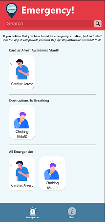
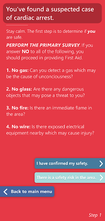
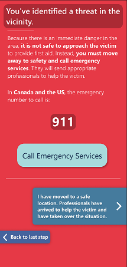
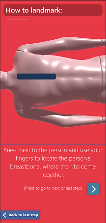
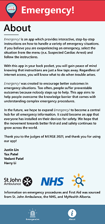

# Emergency!

***Emergency!*** is a mobile app developed for Android which provides interactive, step-by-step instructions on how to tackle a variety of emergency situations. Unlike other emergency apps, it was developed in Unity and uses the power of 3D modeling and animation to guide users through difficult procedures.

For users looking to edit / update the project code, you will require a **Unity 2019.4.13** installation. Select the first folder named “Emergency!” as the project folder.

***Emergency!*** was submitted for the **MERGE 2021** hack + policython in the Healthcare track. Our written policy is not found in this repository: instead, it was submitted on DevPost.

# Purpose
With ***Emergency!*** in your back pocket, you will gain peace of mind knowing that instructions are just a few taps away. Regardless of internet access, you will know what to do when trouble arises.

***Emergency!*** was created to encourage better outcomes in emergency situations. Too often, people suffer preventable outcomes because nobody steps up to help. This app aims to help people overcome the knowledge barrier that comes with understanding complex emergency procedures.

In the future, we hope to expand ***Emergency!*** to become a central hub for all emergency information. It could become an app that everyone has installed on their devices for safety. We hope that the movement towards better first-aid and safety continues to grow across the world.

# Usage
If you wish to try out the app without touching any code, you have 2 options. If you have an Android device, use the `Emergency! App.apk` file to install the app on your device. Please note that an alert may pop up saying that app installation from an unknown source is restricted. If you see this alert, press “Settings” and enable “Allow installation of applications from unknown sources”.

If you do not have an Android device, we’ve also included a PC standalone build. Open the folder named “Emergency! PC Build” and open the `.exe` file.

When the app is opened, you will be greeted with 2 disclaimers. These are accurate for Canadian residents.

In the main menu, you will be shown a gallery of emergency situations. For this demo, we have built 2 fully completed emergencies: **Cardiac Arrest** and **Choking**. If you believe you are in one of these emergency situations, select the option.

Once you select an option, interactive instructions will be shown to you. Follow these instructions to learn how to take action in your situation. 

A unique feature of ***Emergency!*** is its use of 3D models to guide the user through a situation. For example, the app can show a diagram of exactly how to landmark a patient’s chest during CPR. These innovative features are possible due to the app being created in ***Unity***.

# Notes
The folder named “ReadMeImages” contains screenshots which are displayed in this `README.md` file. These are not used in the project or app.

This app was originally created by a team of 4 students for the MERGE 2021 hackathon. The members were split into 2 teams:

## Hack

* Justin Lin

* Yax Patel

*The hackers built the Unity application that is found in this repository.*

## Policy

* Vedant Patel

* Harry Li

*These writers created the policy brief that was submitted alongside the hack project.*

## We would like to thank the organizers and judges of MERGE 2021 for creating an exciting and one-of-a-kind event!

